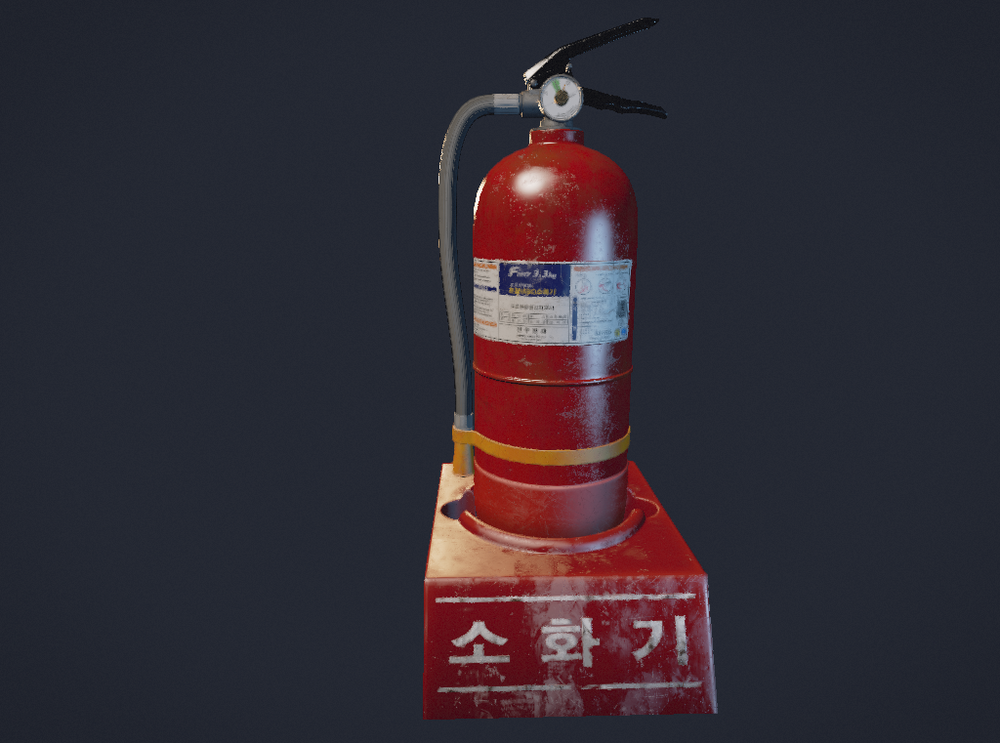

# beva

beva (lowercase) is a thin wrapper over the Vulkan API. It abstracts away very
little functionality from the original API and keeps the low-level design.

# Overview

The `beva.hpp` header (which is the only one) uses the `bv` namespace and
contains 4 different regions.

1. __dynamic\_bitset:__ This regions contains a copy of the
[dynamic_bitset](https://github.com/pinam45/dynamic_bitset/blob/ac60c9e6c534db7457ca6af02fdedbe74ad60968/include/sul/dynamic_bitset.hpp)
library by [pinam45](https://github.com/pinam45/). Dynamic bitsets are used for
memory management in beva.

2. __Data-only structs and enums:__ This region provides tiny wrappers for
Vulkan structs that use STL containers and types like `std::vector`,
`std::array`, `std::string`, and `std::optional` instead of raw pointers and
arrays. These structs also hide away useless fields like flags that are reserved
for the future and the _usually_ redundant `sType` and `pNext` fields. This
region also contains `Version`, a wrapper around the `VK_MAKE_API_VERSION` and
`VK_API_VERSION_XXXX` macros used for encoding and decoding versions in
integers.

3. __Error handling:__ beva throws exceptions of type `Error` for error
handling. `Error` can be constructed from a message and an optional `VkResult`
and provides a `to_string()` function with descriptions for every `VkResult`
based on the Vulkan specification.

4. __Classes and object wrappers:__ Contains wrapper classes for Vulkan objects.
This will be further explained below.

5. __Helper functions:__ This is self explanatory.

6. __Memory management:__ This region contains helper classes for managing
device memory allocations and splitting them into several chunks for different
images and buffers in a thread-safe manner. This will be further explained
below.

In the header, you'll find comments containing links to the Khronos manual above
wrapper structs, classes, and functions. I encourage you to read them to
learn how to use them properly.

## Classes

beva provides `Context` for instance management. A `Device` can then
be created with that context. Finally, normal objects like `Image` can be
created within that device. These classes include member functions covering
common usage of them, for example, `Device::retrieve_queue()` or
`CommandBuffer::begin()`.

For convenience, some classes automatically fetch and store commonly used
information. For example, `Swapchain::create()` will fetch the associated images
and store them in a vector you can access by calling `images()`. Another example
is `Image` or `Buffer` fetching their memory requirements on creation.

Apart from these, there is also `DebugMessenger` which is a wrapper around
`VkDebugUtilsMessengerEXT` from the `VK_EXT_debug_utils` extension.

Finally, `Allocator` is an abstract class that lets you implement your own
memory allocator for the Vulkan driver to use. You can use
`Context::set_allocator()` to set an allocator for that context and every
`Device` based on it, and every object created and destroyed within that
`Device`.

## More On Context

`Context` provides a `fetch_physical_devices()` function that can take an
optional `Surface` as an argument. This function returns a vector of
`PhysicalDevice` objects already containing information such as device
properties, features, memory properties, and queue families, as well as
swapchain support details (formats, present modes, etc.) if a surface was
provided.

`Context` also provides static functions for getting a list of available
layers or extensions.

# RAII & Smart Pointers

beva uses RAII. Object wrappers have a static `create()` function that usually
takes in a config struct and returns a shared pointer of the associated type.
The destructor will try to delete the underlying Vulkan object if possible.

beva uses weak pointers in config structs and for member variables to avoid
circular or unwanted references preventing deletion of objects. This means, for
example, a `Fence` will only hold a weak pointer to its parent `Device`,
so you can delete the device before the fence. When the fence's destructor is
invoked, it will first check if the weak pointer to the device has expired and
do nothing if so. However, if you call a member function on the fence that needs
to use the device, an `Error` will be thrown complaining about the weak pointer
having expired.

# Memory Management

| Term | Description |
| - | - |
| Block | A small portion of a device memory, by default 1024 bytes. |
| Region | A huge amount of allocated device memory which acts as a memory arena for virtually allocating chunks. A region also contains a bitset to represent which blocks are allocated. |
| Chunk | A virtually allocated range inside a memory region. |
| Bank | Manages a list of memory regions and provides logic for allocating new chunks. |

beva provides `MemoryBank` for device memory management. A `MemoryBank` manages
a list of `MemoryRegions` internally. A `MemoryRegion` simply contains a
`DeviceMemory` and a bitset to represent which blocks are allocated.

You can call `MemoryBank::allocate()` to get a `MemoryChunk` that you can bind
to your image or buffer using its `bind()` functions. `MemoryBank::allocate()`
will automatically handle finding a free range inside a compatible region, or
creating a new one if none were found. It will also take care of alignment
requirements. These operations are all thread safe and use a mutex under the
hood.

A `MemoryChunk` will mark its corresponding blocks as free upon destruction.
`MemoryBank::allocate()` will check for empty regions and delete them when
needed.

Additionally, you can call `mapped()` and `flush()` on a `MemoryChunk` if it was
allocated from a host visible region. Note that you can pass the required memory
properties (like host visible or device local) as an argument to
`MemoryBank::allocate()`.

# Expectations

beva only implements a tiny section of the Vulkan API, mostly the parts needed
for traditional rasterized rendering and compute shaders. You can call
`handle()` on an object wrapper to get its raw handle and directly use the
Vulkan API to implement what beva doesn't cover.

beva will __not__ try and catch invalid input. It's totally possible to get
undefined behavior and crashes with beva if used incorrectly. To avoid these
situations, read the Khronos manual pages linked above structs, classes, and
functions to see how to use them properly. For example, whether a
`std::shared_ptr` field can be `nullptr` or must have a value, or in what
conditions a `std::optional` field can actually be `std::nullopt`.

beva is not tested enough to be called stable or ready for production at all. It
is just a fun side project at most.

# Documentation

I don't have time to write documentation but looking at the header, this page,
the demos, and Khronos manual pages should give you enough information on how to
use beva.

# Including beva

Make a new directory named `beva` somewhere in your include directories and copy
`beva/src/lib/beva/beva.hpp` and `beva.cpp` into it. Make sure your compiler is
recognizing and actually compiling `beva.cpp`. And of course, make sure to set
up and include the latest Vulkan SDK such that `#include "vulkan/vulkan.h"`
works. [Here's a tutorial on that.](https://docs.vulkan.org/tutorial/latest/02_Development_environment.html)

Note: beva requires C++20.

# Demos

Check out `beva/src/demos` to see how to use beva. If you build and run the
project in Visual Studio, you'll get asked to choose a demo to run.

## 00: First Triangle

This demo implements the very basics needed to draw a triangle to the screen.
Devices, swapchains, vertex buffers, that sort of stuff.

## 01: Textured Model (Baked Lighting)

This demo builds on top of the first one and implements uniform buffers,
textures, depth buffering, mipmaps, multisampling, instanced rendering, and push
constants. It uses an external library to load an OBJ model.
[The model is from PolyHaven.com.](https://polyhaven.com/a/korean_public_payphone_01)

## 02: Wave Simulation

This demo uses a compute shader to drive a wave simulation. It uses shader
storage images for the simulation and specialization constants to send
local invocation sizes to the compute shader at runtime without recompiling it.

The wave simulation code is mostly based on [this shadertoy.](https://www.shadertoy.com/view/mdScW1)

## 03: Deferred Rendering

Being the most complex of them all, this one uses what's called a G-Buffer to
only render what's essential for lighting. This is different for every
application, but in this case the G-Buffer contains two images with the
following data:
1. **Diffuse-metallic:** This image stores diffuse color data in the first three
channels and metalness in the fourth one.
2. **Normal-roughness:** This one stores the world-space normal in the first two
channels using spherical coordinates and the roughness value in the third
channel. The fourth channel is simply a toggle that defines whether the pixel
should be lit or it is unlit (like the background, or an emissive surface).

The geometry pass is what renders to the G-Buffer. A lighting pass then draws a
full-screen quad and samples the the G-Buffer images to render a properly lit
scene. It uses a shader storage buffer object (SSBO) to read and use an array of
lights updated from the CPU. Finally, a post processing pass samples the output
from the lighting pass to apply FXAA-like antialiasing, some post processing,
and [flim](https://github.com/bean-mhm/flim), my filmic color transform.

Deferred rendering is most useful when you have a lot of lights, or a lot of
overdraw such that the lighting calculations for a pixel get completely
discarded as another one is drawn on top of it. None of these are a problem is
the extremely simple "scene" in this demo, though.

[The 3D model in this demo is from PolyHaven.com.](https://polyhaven.com/a/korean_fire_extinguisher_01)
